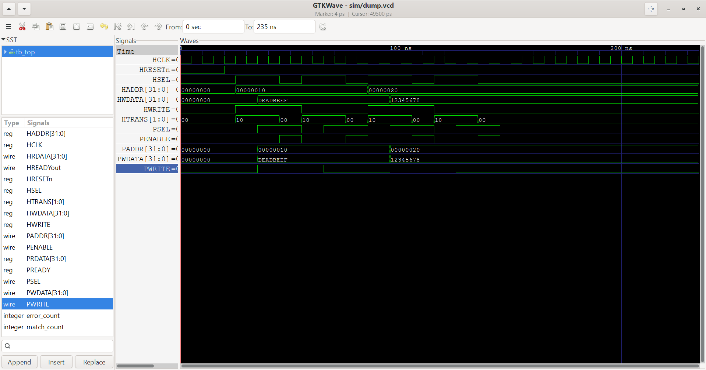

# AHB-to-APB Bus Bridge Verification

## Overview
This repository contains a SystemVerilog-based Verification Environment for an AHB-Lite to APB Bridge RTL module.

## Verification Plan Matrix

| Feature | Test Case | Target Coverage |
| :--- | :--- | :--- |
| **Reset Behavior** | Verify default signals on active-low reset | 100% state coverage |
| **Write Transfer** | Single write transaction with valid address & data | APB protocol timing check |
| **Read Transfer** | Single read transaction sampling data back from APB | Data integrity match |
| **Back-to-Back Transfers** | Sequential write and read without idle cycles | State machine transitions |
| **Wait-State (PREADY)** | APB slave inserting wait cycles via `PREADY = 0` | Bridge stall capability |

## Project Progress
- [x] **Day 1:** Project structure setup & AHB-to-APB Bridge RTL written
- [x] **Day 2:** Verification Plan defined & documented
- [x] **Day 3:** SystemVerilog Interface, Clocking Blocks, & Modports
- [ ] **Day 4:** Transaction Object Class & Constraints
- [ ] **Day 5:** Generator & Driver Components
- [ ] **Day 6:** Passive Monitor Component
- [ ] **Day 7:** Scoreboard & Reference Model
- [ ] **Day 8:** Functional Coverage & SystemVerilog Assertions (SVA)
- [ ] **Day 9:** Top Testbench Integration & GTKWave Simulation Analysis
- [ ] **Day 10:** Final Documentation & Repository Cleanup
## Simulation & Verification Results

### Signal Waveforms (GTKWave)

### Verification Summary
* **Simulator:** Icarus Verilog (`iverilog`) + `vvp`
* **Waveform Viewer:** GTKWave (`sim/dump.vcd`)
* **Test Outcome:** Directed transactions executed successfully. AHB-to-APB timing, phase transitions (`PSEL`, `PENABLE`), and bus data verified via waveform analysis.
*